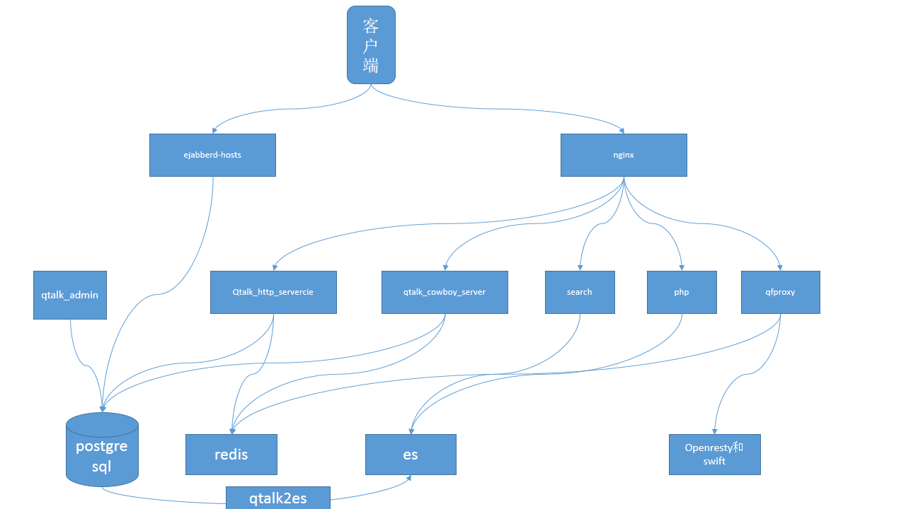

# 我们的官网

[云趣聊](https://im.qunar.com)

# 包括的服务

<table>
        <tr>
            <th>软件</th><th>说明</th><th>备注</th>
        </tr>
        <tr>
            <th>openresty</th><th>docker服务</th><th>已实现</th>
        </tr>
        <tr>
            <th>swift</th><th>docker服务</th><th>已实现</th>
        </tr>
        <tr>
            <th>swift openresty</th><th>docker服务</th><th>已实现</th>
        <tr>
            <th>openresty</th><th>docker服务</th><th>已实现</th>
        </tr>
        <tr>
            <th>redis</th><th>docker服务</th><th>已实现</th>
        </tr>
        <tr>
            <th>postgresql</th><th>docker服务</th><th>已实现</th>
        </tr>
        <tr>
            <th>php</th><th>docker服务</th><th>已实现</th>
        </tr>
        <tr>
            <th>search</th><th>docker服务</th><th>已实现</th>
        </tr>
        <tr>
            <th>qtalk_admin</th><th>docker服务</th><th>已实现</th>
        </tr>
        <tr>
            <th>qtalk2es</th><th>docker服务</th><th>已实现</th>
        </tr>
        <tr>
            <th>qfproxy</th><th>docker服务</th><th>已实现</th>
        </tr>
        <tr>
            <th>qtalk_http_service</th><th>docker服务</th><th>已实现</th>
        </tr>
        <tr>
            <th>qtalk_cowboy_server</th><th>docker服务</th><th>已实现</th>
        </tr>
        <tr>
            <th>ejabberd</th><th>docker服务</th><th>已实现</th>
        </tr>
</table>

# 服务结构



# 依赖的环境(相关配置，（请参考最后面的常见问题）
* `Centos 7`
* 设置安装用户的资源限制(ulimit)
* `安装用户需要有sudo且免密权限(必须设置)`
* `关闭SeLinux（必须设置）`
* `主机名格式为: xxx.xxx（至少需要一个点分开，必须设置）`
* `开启IPv4 forwarding`

# 安装步骤

## 安装参考视频
[参考视频](http://qt.qunar.com/downloads/qtalkonekey/install.mp4)

## 方法1(不需要在线下载docker  镜像)

将安装包qtalkonekey-master.zip和images.zip拷贝到服务器上，然后执行以下命令(默认会创建两个用户(test和test_admin，密码是test)：
- qtalkonekey-master.zip：在github点击download zip下载该项目
- images.zip：从[这里](http://qt.qunar.com/downloads/qtalkonekey/images)下载打包好的镜像

```
unzip qtalkonekey-master.zip && unzip images.zip -d ./qtalkonekey-master/ && cd qtalkonekey-master
# --hosturl为服务器IP
# --hostname为host（域）
bash docker-install.sh --hostname test.com --hosturl 10.86.2.83
```

## 方法2(需要在线下载docker  镜像)

将安装包qtalkonekey-master.zip拷贝到服务器上，然后执行以下命令(默认会创建两个用户(test和test_admin，密码是test)：
- qtalkonekey-master.zip：在github点击download zip下载该项目

```
unzip qtalkonekey-master.zip && cd qtalkonekey-master
# --hosturl为服务器IP
# --hostname为host（域）
bash docker-install.sh --hostname test.com --hosturl 10.86.2.83
```

## 安装结果
```
安装结果
docker service
CONTAINER ID        IMAGE                              COMMAND                  CREATED              STATUS                  PORTS                                                                                                                  NAMES
c4b646a5ddd7        morrisjobke/docker-swift-onlyone   "/bin/sh -c /usr/loca"   About a minute ago   Up About a minute       0.0.0.0:8080->8080/tcp                                                                                                 l-swift.cn
adbc9c539391        php:5.6-apache-pgsql-redis         "docker-php-entrypoin"   About a minute ago   Up About a minute       80/tcp, 0.0.0.0:9991->9991/tcp                                                                                         l-search.cn
e252a1a6b729        php:5.6-apache-pgsql-redis         "docker-php-entrypoin"   About a minute ago   Up About a minute       80/tcp, 0.0.0.0:9990->9990/tcp                                                                                         l-qtalk.admin.cn
aa8855363dbf        erlang:17.5                        "/root/qtalk_cowboy_s"   About a minute ago   Up Less than a second   0.0.0.0:10056->10056/tcp                                                                                               l-qtalk.cowboy.server.cn
3be73b363657        tomcat:8.0.20-jre8                 "catalina.sh run"        About a minute ago   Up About a minute       8080/tcp, 0.0.0.0:9888->9888/tcp                                                                                       l-qtalk.http.service.cn
79a4567a4184        tomcat:8.0.20-jre8                 "catalina.sh run"        About a minute ago   Up About a minute       0.0.0.0:8000->8000/tcp, 8080/tcp                                                                                       l-qfproxy.cn
ed769c18fe3c        erlang:19.3                        "/home/q/ejabberd-hos"   About a minute ago   Up 13 seconds           0.0.0.0:4369->4369/tcp, 0.0.0.0:5201-5202->5201-5202/tcp, 0.0.0.0:5222-5223->5222-5223/tcp, 0.0.0.0:10050->10050/tcp   l-ejabberd.hosts.cn
c1a38e5f3ff4        tomcat:8.0.20-jre8                 "catalina.sh run"        About a minute ago   Up About a minute       8080/tcp, 0.0.0.0:9988->9988/tcp                                                                                       l-qtalk2es.cn
38e180bcbf9b        php:5.6-apache-pgsql-redis         "docker-php-entrypoin"   About a minute ago   Up About a minute       80/tcp, 0.0.0.0:9999->9999/tcp                                                                                         l-php.cn
b298231d8ceb        postgres:10.1                      "docker-entrypoint.sh"   About a minute ago   Up About a minute       0.0.0.0:5432->5432/tcp                                                                                                 l-postgres.cn
6a22ca74ba86        openresty/openresty:trusty         "/usr/local/openresty"   About a minute ago   Up About a minute       0.0.0.0:8088->8088/tcp                                                                                                 l-swift.nginx.cn
1c8b7ed73b1c        elasticsearch:2.4                  "/docker-entrypoint.s"   About a minute ago   Up About a minute       0.0.0.0:9200->9200/tcp, 0.0.0.0:9300->9300/tcp                                                                         l-elasticsearch.cn
0573dc63edde        openresty/openresty:trusty         "/usr/local/openresty"   About a minute ago   Up About a minute       0.0.0.0:80->80/tcp                                                                                                     l-nginx.cn
5985a31bf7b8        redis:latest                       "docker-entrypoint.sh"   About a minute ago   Up About a minute       0.0.0.0:6379->6379/tcp                                                                                                 l-redis.cn
  ___ _____  _    _     _  __
 / _ \_   _|/ \  | |   | |/ /
| | | || | / _ \ | |   | ' / 
| |_| || |/ ___ \| |___| . \ 
 \__\_\|_/_/   \_\_____|_|\_\
导航地址是：http://10.86.2.83/php/nav.php
管理界面地址是：http://10.86.2.83:9990/mainSite/domain_user_manager.php


```

## 脚本参数的规则
```
hostname的值必须是：数字，小写字母，英文符号点(.)，且小写字母开头

	[a-z][a-z0-9.]*
```

# 客户端下载和使用

安装完成后，我们从[这里](https://im.qunar.com/pubim/pub/mainSite/download.php)下载[windows 64位客户端](https://qt.qunarzz.com/downloads/qtalk_setupx64.exe)，按照说明填写导航地址，使用用户名(test)和密码(test)登录即可。

## 备注
- 我们要保持手机能访问到服务器
- 我们支持的客户端包括：windows/linux/mac/iphone/android等，详细信息科参考[官网说明](https://im.qunar.com/pubim/pub/mainSite/download.php)

# docker操作
命令参考地址：[Docker 命令大全](http://www.runoob.com/docker/docker-command-manual.html)

```
查看当前运行的docker

[monkboy@localhost qtalkonekey-master]$ sudo docker ps -a
CONTAINER ID        IMAGE                              COMMAND                  CREATED             STATUS                     PORTS                                                                                                                  NAMES
c4b646a5ddd7        morrisjobke/docker-swift-onlyone   "/bin/sh -c /usr/loca"   About a minute ago   Up About a minute       0.0.0.0:8080->8080/tcp                                                                                                 l-swift.cn
adbc9c539391        php:5.6-apache-pgsql-redis         "docker-php-entrypoin"   About a minute ago   Up About a minute       80/tcp, 0.0.0.0:9991->9991/tcp                                                                                         l-search.cn
e252a1a6b729        php:5.6-apache-pgsql-redis         "docker-php-entrypoin"   About a minute ago   Up About a minute       80/tcp, 0.0.0.0:9990->9990/tcp                                                                                         l-qtalk.admin.cn
aa8855363dbf        erlang:17.5                        "/root/qtalk_cowboy_s"   About a minute ago   Up Less than a second   0.0.0.0:10056->10056/tcp                                                                                               l-qtalk.cowboy.server.cn
3be73b363657        tomcat:8.0.20-jre8                 "catalina.sh run"        About a minute ago   Up About a minute       8080/tcp, 0.0.0.0:9888->9888/tcp                                                                                       l-qtalk.http.service.cn
79a4567a4184        tomcat:8.0.20-jre8                 "catalina.sh run"        About a minute ago   Up About a minute       0.0.0.0:8000->8000/tcp, 8080/tcp                                                                                       l-qfproxy.cn
ed769c18fe3c        erlang:19.3                        "/home/q/ejabberd-hos"   About a minute ago   Up 13 seconds           0.0.0.0:4369->4369/tcp, 0.0.0.0:5201-5202->5201-5202/tcp, 0.0.0.0:5222-5223->5222-5223/tcp, 0.0.0.0:10050->10050/tcp   l-ejabberd.hosts.cn
c1a38e5f3ff4        tomcat:8.0.20-jre8                 "catalina.sh run"        About a minute ago   Up About a minute       8080/tcp, 0.0.0.0:9988->9988/tcp                                                                                       l-qtalk2es.cn
38e180bcbf9b        php:5.6-apache-pgsql-redis         "docker-php-entrypoin"   About a minute ago   Up About a minute       80/tcp, 0.0.0.0:9999->9999/tcp                                                                                         l-php.cn
b298231d8ceb        postgres:10.1                      "docker-entrypoint.sh"   About a minute ago   Up About a minute       0.0.0.0:5432->5432/tcp                                                                                                 l-postgres.cn
6a22ca74ba86        openresty/openresty:trusty         "/usr/local/openresty"   About a minute ago   Up About a minute       0.0.0.0:8088->8088/tcp                                                                                                 l-swift.nginx.cn
1c8b7ed73b1c        elasticsearch:2.4                  "/docker-entrypoint.s"   About a minute ago   Up About a minute       0.0.0.0:9200->9200/tcp, 0.0.0.0:9300->9300/tcp                                                                         l-elasticsearch.cn
0573dc63edde        openresty/openresty:trusty         "/usr/local/openresty"   About a minute ago   Up About a minute       0.0.0.0:80->80/tcp                                                                                                     l-nginx.cn
5985a31bf7b8        redis:latest                       "docker-entrypoint.sh"   About a minute ago   Up About a minute       0.0.0.0:6379->6379/tcp                                                                                                 l-redis.cn

[monkboy@localhost qtalkonekey-master]$ 

停止某个docker
[monkboy@localhost qtalkonekey-master]$ sudo docker stop l-php.cn
l-php.cn

启动某个docker
[monkboy@localhost qtalkonekey-master]$ sudo docker start l-php.cn
l-php.cn

重启某个docker
[monkboy@localhost qtalkonekey-master]$ sudo docker restart l-php.cn
l-php.cn

查看某个docker的日志
[monkboy@localhost qtalkonekey-master]$ sudo docker logs l-php.cn
AH00558: apache2: Could not reliably determine the server's fully qualified domain name, using localhost.localdomain. Set the 'ServerName' directive globally to suppress this message
AH00558: apache2: Could not reliably determine the server's fully qualified domain name, using localhost.localdomain. Set the 'ServerName' directive globally to suppress this message
[Tue Jan 09 17:39:24.407752 2018] [mpm_prefork:notice] [pid 1] AH00163: Apache/2.4.10 (Debian) PHP/5.6.33 configured -- resuming normal operations
[Tue Jan 09 17:39:24.407818 2018] [core:notice] [pid 1] AH00094: Command line: 'apache2 -D FOREGROUND'
[Tue Jan 09 18:20:21.342569 2018] [mpm_prefork:notice] [pid 1] AH00169: caught SIGTERM, shutting down
AH00558: apache2: Could not reliably determine the server's fully qualified domain name, using localhost.localdomain. Set the 'ServerName' directive globally to suppress this message
AH00558: apache2: Could not reliably determine the server's fully qualified domain name, using localhost.localdomain. Set the 'ServerName' directive globally to suppress this message
[Tue Jan 09 18:20:25.813144 2018] [mpm_prefork:notice] [pid 1] AH00163: Apache/2.4.10 (Debian) PHP/5.6.33 configured -- resuming normal operations
[Tue Jan 09 18:20:25.813221 2018] [core:notice] [pid 1] AH00094: Command line: 'apache2 -D FOREGROUND'
[Tue Jan 09 18:20:28.523184 2018] [mpm_prefork:notice] [pid 1] AH00169: caught SIGTERM, shutting down
AH00558: apache2: Could not reliably determine the server's fully qualified domain name, using localhost.localdomain. Set the 'ServerName' directive globally to suppress this message
AH00558: apache2: Could not reliably determine the server's fully qualified domain name, using localhost.localdomain. Set the 'ServerName' directive globally to suppress this message
[Tue Jan 09 18:20:28.820189 2018] [mpm_prefork:notice] [pid 1] AH00163: Apache/2.4.10 (Debian) PHP/5.6.33 configured -- resuming normal operations
[Tue Jan 09 18:20:28.820259 2018] [core:notice] [pid 1] AH00094: Command line: 'apache2 -D FOREGROUND'

进入某个docker的shell
[monkboy@localhost qtalkonekey-master]$ sudo docker exec -it l-php.cn /bin/bash
root@localhost:/var/www/html# exit
[monkboy@localhost qtalkonekey-master]$ 

杀掉某个docker

[monkboy@localhost qtalkonekey-master]$ sudo docker kill -s KILL l-php.cn
l-php.cn

删除某个容器

[monkboy@localhost qtalkonekey-master]$ sudo docker rm -f l-php.cn
l-php.cn

查看镜像
[monkboy@localhost qtalkonekey-master]$ sudo docker images
REPOSITORY                         TAG                      IMAGE ID            CREATED             SIZE
php                                5.6-apache-pgsql-redis   b0afdac2273a        4 hours ago         400.2 MB
erlang                             19.3                     40aee9f768a6        11 days ago         793.3 MB
erlang                             17.5                     ade2e53fc6e4        11 days ago         787.2 MB
docker.io/busybox                  latest                   807fd4df40d1        3 weeks ago         1.143 MB
elasticsearch                      2.4                      5936d78e60bb        7 weeks ago         573.7 MB
docker.io/redis                    latest                   1e70071f4af4        7 weeks ago         106.7 MB
postgres                           10.1                     ec61d13c8566        7 weeks ago         286.9 MB
openresty/openresty                trusty                   7625a9755cf2        8 weeks ago         459.5 MB
morrisjobke/docker-swift-onlyone   latest                   88fcc0a83749        18 months ago       275.6 MB
tomcat                             8.0.20-jre8              e88a065848be        2 years ago         492.6 MB

```

# postgresql服务操作

```
# 进入postgresql的docker中
[monkboy@localhost qtalkonekey-master]$ sudo docker exec -it -u postgres l-postgres.cn /bin/bash
postgres@l-postgres:/$ psql -d ejabberd                                                                                                                                                                                                                                      
psql (10.1)
Type "help" for help.

ejabberd=# select * from host_users;
 id | host_id |  user_id   | user_name  | department | tel | email | dep1 | dep2 | dep3 | dep4 | dep5 |  pinyin   | frozen_flag | version | user_type | hire_flag | gender | password | initialpwd | ps_deptid 
----+---------+------------+------------+------------+-----+-------+------+------+------+------+------+-----------+-------------+---------+-----------+-----------+--------+----------+------------+-----------
  1 |       1 | test_admin | test_admin | /度假      |     |       | 度假 |      |      |      |      | lffan.liu |           0 |       1 | U         |         1 |      0 | test     |          1 | QUNAR
  2 |       1 | test       | test       | /度假      |     |       | 度假 |      |      |      |      | lffan.liu |           0 |       1 | U         |         1 |      0 | test     |          1 | QUNAR
(2 rows)

ejabberd=# select * from host_info; 
 id |   host   | description |          create_time          | host_admin 
----+----------+-------------+-------------------------------+------------
  1 | test.com | test.com    | 2018-01-26 14:18:18.597628+08 | test_admin
(1 row)

ejabberd=# \q
postgres@l-postgres:/$ exit
[monkboy@localhost ~]$ 
```

# redis服务操作
```
[monkboy@localhost qtalkonekey-master]$ sudo docker exec -it l-redis.cn /bin/bash
root@l-redis:/data# redis-cli 
127.0.0.1:6379> auth 27594e8a-877e-11e5-bd52-6bced77c06ee
OK
127.0.0.1:6379> SELECT 1
OK
127.0.0.1:6379[1]> SET "key" "value"
OK
127.0.0.1:6379[1]> GET "key"
"value"
127.0.0.1:6379[1]> exit
root@l-redis:/data# exit
exit
[monkboy@localhost qtalkonekey-master]$ 
```

# 常见问题

## 怎么关闭SeLinux
```
sudo vi /etc/selinux/config
将SELINUX=enforcing改为SELINUX=disabled
设置后需要重启才能生效
```

## 怎么设置sudo且免密权限
参考：[设置sudo且免密权限](https://zhidao.baidu.com/question/647845350957409925.html)

```
打开终端，先以 root 身份登录：
su root
然后执行：
visudo
在打开的文件中，找到下面这一行：
root ALL=(ALL) ALL
并紧帖其下面，添上自己，如我的用户名是： Dawnson，则添上 ：
Dawnson     ALL=(ALL)  ALL
如果只做到这一步，
然后保存，那么就能使用 sudo 命令了。要让执行时不需要输入密码，再找到下面这一句：
#%wheel  ALL=(ALL)         NOPASSWD: ALL
将光标移至“ # ”上面，按下X键，其实也就是把这句话的注释去掉，让这句话生效。
最后按住“Shift+ ：”键（也就是Shift上档输入一个冒号），进入 vi的命令模式，输入“wq”两个字母（Write and quit）保存并退出编辑。
退出 vi 后，再执行：
gpasswd -a YourUserName wheel
将你的用户（普通用户）调整至“ wheel ”用户组里面。这以后，就可以每次执行 sudo 命令时不再输入密码了。
```

## 防火墙
```
sudo yum -y install firewalld # 安装防火墙

systemctl stop firewalld.service #停止firewall

systemctl disable firewalld.service #禁止firewall开机启动

systemctl start firewalld.service #开启firewall

systemctl enable firewalld.service #设置firewall开机启动

sudo firewall-cmd --zone=public --add-port=9990/tcp --permanent # 添加开放的端口

sudo firewall-cmd --reload # 重新加载配置
```

## 镜像版本

### 1.0.0
```
[monkboy@localhost qtalkonekey-master]$ sudo docker images
REPOSITORY                         TAG                      IMAGE ID            CREATED             SIZE
php                                5.6-apache-pgsql-redis   b0afdac2273a        4 hours ago         400.2 MB
erlang                             19.3                     40aee9f768a6        11 days ago         793.3 MB
erlang                             17.5                     ade2e53fc6e4        11 days ago         787.2 MB
docker.io/busybox                  latest                   807fd4df40d1        3 weeks ago         1.143 MB
elasticsearch                      2.4                      5936d78e60bb        7 weeks ago         573.7 MB
docker.io/redis                    latest                   1e70071f4af4        7 weeks ago         106.7 MB
postgres                           10.1                     ec61d13c8566        7 weeks ago         286.9 MB
openresty/openresty                trusty                   7625a9755cf2        8 weeks ago         459.5 MB
morrisjobke/docker-swift-onlyone   latest                   88fcc0a83749        18 months ago       275.6 MB
tomcat                             8.0.20-jre8              e88a065848be        2 years ago         492.6 MB
```

## 简单HTTP服务，提供下载
```
python -m SimpleHTTPServer 7777
python -m http.server 7777
```

## Centos 7 开启ipv4 forwarding
You should add: `net.ipv4.ip_forward = 1`  into file `/usr/lib/sysctl.d/50-default.conf` and  `/sbin/sysctl -p` or `reboot`.

## 抓取HTTP报文
```
sudo tcpdump -XvvennSs 0 -i enp0s3 tcp[20:2]=0x4745 or tcp[20:2]=0x4854
```

## docker 打包镜像
```
sudo docker save postgresql:1.0.0 > postgresql:1.0.0.tar
sudo load < postgresql:1.0.0.tar
```

## 建立网络
```
docker network  create  --subnet=172.28.0.0/16 --gateway=172.28.5.254 qtalkpackagegit_default
docker network  create  --subnet=172.29.0.0/16 --gateway=172.29.5.254 qtalkpackagegit_qtalknet

cat /etc/docker/daemon.json
  "iptables": true,
  "ip-forward": true,
  "ip-masq": true,
还有，这三个参数记得改
要不然bridge用不了
```

## docker镜像

该项目使用的docker镜像只有三个是自己build的，Dockerfile文件在`dockerfile/`目录下，其它都是来自docker hub上的官方源。

# 反馈方式

- 邮箱：qtalk@qunar.com
- issues